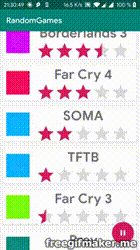

# RandomGames
A Coding Challenge from 2019 including Kotlin, Koin, Databinding, MVVM, Coroutines and more 

# Assignment Description:

>### 1.Pick your top 10 fav books, movies, video games, food, or whatever you wish. Build an Android app that lists these items. You don’t need a backend service to load this list of items. Use sensible hardcoding. 

*I choose games, mostly those that came to my mind first*

>### 2.Create a rating system where you can rate each item. Order the list by the highest rated item to lowest rated item. Re-order the list, if needed, when user ranks an item.

*Reordering done via ListAdapter<>, which is provided by the Android SDK and has animations pretty much built in*

>### 3. Using RxJava or similar technique, randomly rate items at random times, also re-ordering the list as necessary. To elaborate this more put a button called RANDOM RATING and on click of this button code will start rating random item at random time with random rating. And on same button press again it will stop random rating.

*I used Kotlin Coroutines, and the button is a FAB with an Icon*

>### Notes:

>1. Feel free to use any UI elements or library.

*I didn't use any external UI stuff, even though I considered it at the beginning*

>2. Focus on test driven approach while coding this assignment.

*Tests are here: [Test Folder](https://github.com/Merthan/RandomGames/tree/master/app/src/test/java/com/gmail/me2development/randomgames)*

>3. Focus on good development practices like proper architecture, dependency injection, databinding etc.

*DI: Koin, Databinding Two-Way, MVVM including LiveData*

>4. No need to write UI tests but a good unit test coverage is desired.

*[Test Folder](https://github.com/Merthan/RandomGames/tree/master/app/src/test/java/com/gmail/me2development/randomgames)*

